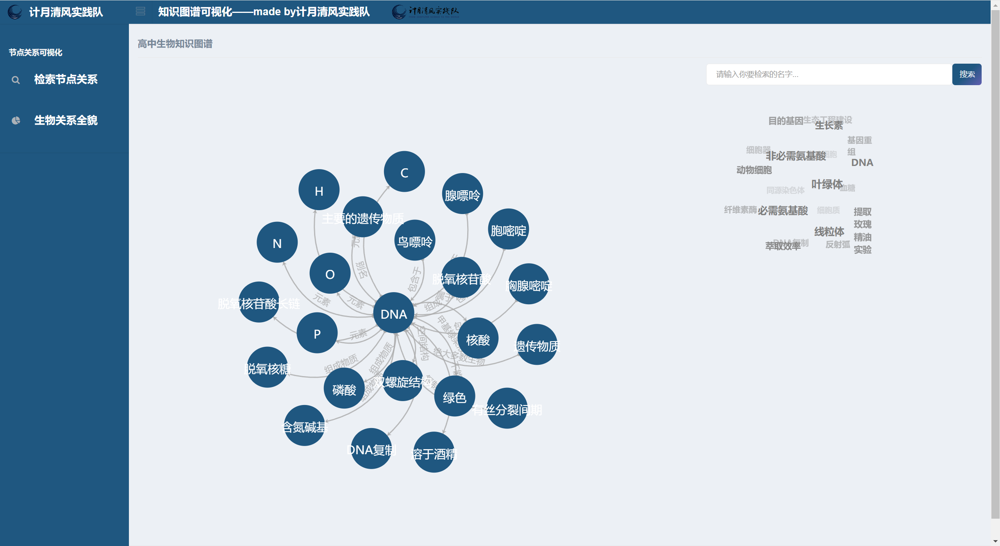
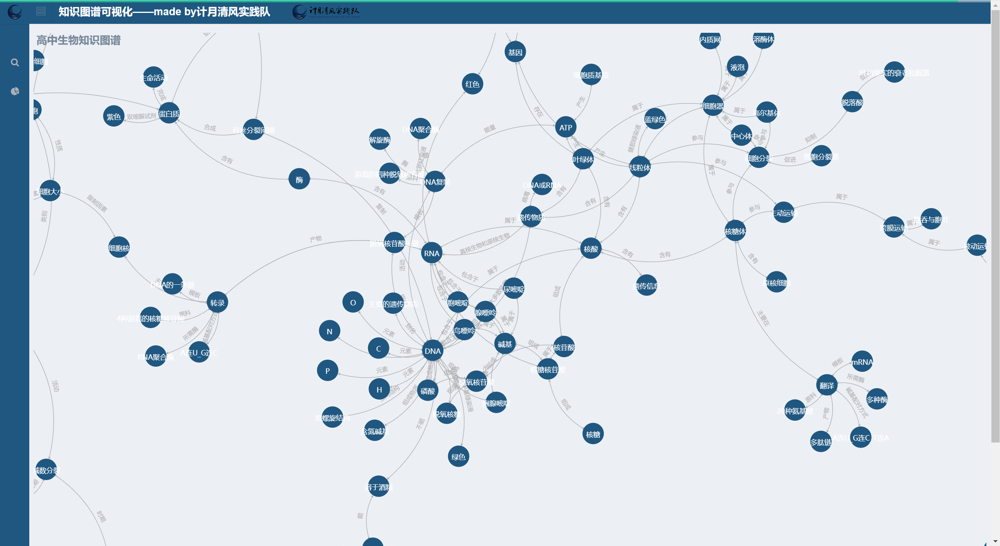

# 生物知识图谱可视化及节点查询系统 😘

## 项目预览 😍






## 文件树介绍

```
1..venv 文件夹是使用 python 中的 venv 创建的虚拟环境，可以换成自己的虚拟环境
2.neo_db 文件夹是知识图谱的构建模块
	|-config.py 配置参数
	|-create_graph.py 创建知识图谱，图数据库的建立
	|-query_graph.py 知识图谱的查询
3.raw_data 文件夹是存在数据处理后的三元组文件
4.static 文件夹存放css和js，是页面的样式和效果的文件
	|-csv2json.py 创建web端显示出的知识图谱json文件
5.templates 文件夹是HTML的页面
	|-index.html 欢迎界面
	|-search.html 查询关系的页面
	|-all_relation.html 所有关系的页面
6.app.py 是整个系统的主入口
7.requirement 是环境需求
```

## 部署步骤

1. 安装好python所需要的库，执行命令

   ```
   pip install -r requirement.txt
   ```

2. 下载好neo4j图数据库，并配好环境（注意neo4j需要jdk的版本）😶‍🌫️。修改neo_db文件夹下的配置文件config.py,设置图数据库的账号和密码

3. 切换到neo_db文件夹下，执行 create_graph.py 建立知识图谱，也就是将三元组文件导入到neo4j图数据库中

4. 运行python app.py,浏览器打开localhost:5000即可查看

## 个性化配置 😮✌️

如果想要通过此项目构建其他知识图谱，则可以进行如下操作

1. 先准备一个三元组文件，参考raw_data里的relation.txt

   ```
   水蒸气蒸馏,制备,玫瑰精油
   玫瑰精油,实验,提取玫瑰精油实验
   NaCl,增大盐的浓度,提取玫瑰精油实验
   无水Na2SO4,吸收油层水分,提取玫瑰精油实验
   蒸馏,方法,提取玫瑰精油实验
   过滤,方法,提取玫瑰精油实验
   NaCl,是,盐
   压榨法,制备,柑橘精油
   压榨法,制备,柠檬精油
   萃取法,提取,胡萝卜素
   胡萝卜素,实验,提取胡萝卜素实验
   粉碎,方法,提取胡萝卜素实验
   ……
   ```

2. 然后将这个文件分别放入raw_data和static两个文件夹中

3. 切换到static文件夹下，执行 csv2json.py 创建 json 数据以便于前端显示

4. 再依次执行**部署步骤中的3-4步**即可

## 参考 🙌

本项目主要参考了此仓库的实现思路

https://github.com/chizhu/KGQA_HLM   
